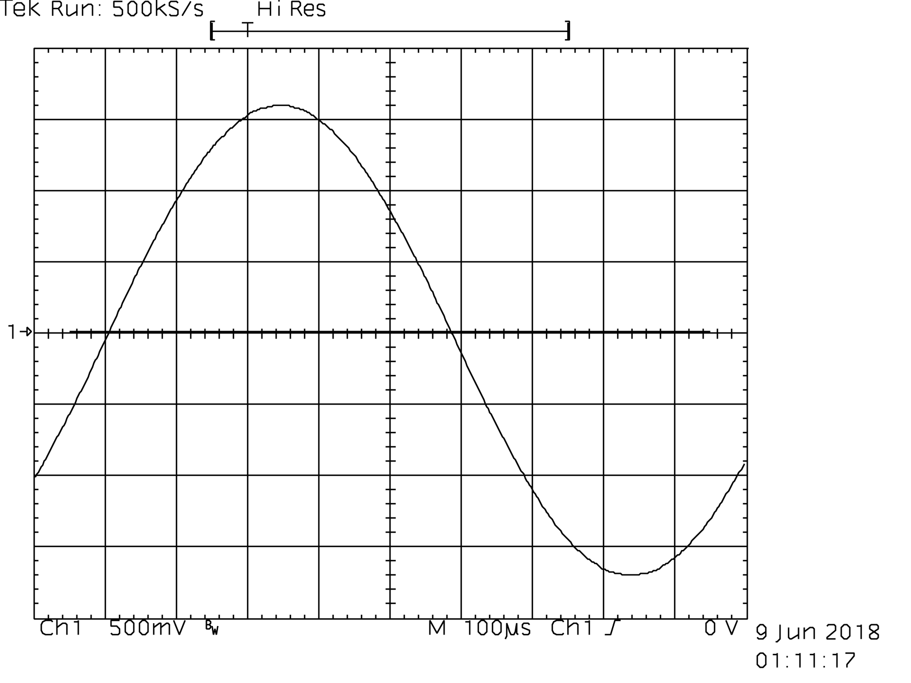

## GPIB adapter using Arduino Nano

Copyright 2018 Toby Thain `toby at telegraphics.com.au`

### Parts list

| Item | Qty | Digikey Part # |
| ---- | --- | -------------- |
| Protoboard | 1 | [SBB1605-1-ND](https://www.digikey.ca/product-detail/en/chip-quik-inc/SBB1605-1/SBB1605-1-ND/5978253) |
| IC socket 20 pin† | 2 | [ED11088-ND](https://www.digikey.ca/product-detail/en/mill-max-manufacturing-corp/110-47-320-41-001000/ED11088-ND/7363964) |
| Header 15 position | 2 | [ED11218-ND](https://www.digikey.ca/product-detail/en/mill-max-manufacturing-corp/801-47-015-10-012000/ED11218-ND/7364093) |
| Decoupling caps, ceramic 0.1µF | 2 | [BC1154CT-ND](https://www.digikey.ca/product-detail/en/vishay-bc-components/K104Z15Y5VE5TH5/BC1154CT-ND/286776) |
| Data Transceiver SN75160BN | 1 | [296-6845-5-ND](https://www.digikey.ca/product-detail/en/texas-instruments/SN75160BN/296-6845-5-ND/370217) |
| Control Transceiver SN75161BN | 1 | [296-6847-5-ND](https://www.digikey.ca/product-detail/en/texas-instruments/SN75161BN/296-6847-5-ND/370219) |
| GPIB cable | 1 | [Ebay - search](https://www.ebay.com/sch/i.html?_from=R40&_nkw=gpib+cable&_sacat=0&_sop=15)  |
| Arduino Nano compatible | 1 | [BrianPTY's Tindie store](https://www.tindie.com/products/BrianPTY/development-board-nano-v3-arduino-compatible) |
| USB Mini-B cable for Nano | 1 |
| Hookup wire | | 
| Zip tie | |

It's assumed you already have tools including solder, iron, drill, wire strippers, X-acto knife, etc.

† My version used the 22 pin DS75162AN, so if you obtain one of these (e.g. ebay) order the 22 pin socket.

| Item | Qty | Digikey Part # |
| ---- | --- | -------------- |
| IC socket 22 pin | 1 | [ED11093-ND](https://www.digikey.ca/product-detail/en/mill-max-manufacturing-corp/110-47-422-41-001000/ED11093-ND/7363969) |

### Pictures of assembled adapter

* [More images at Flickr](https://www.flickr.com/photos/qu1j0t3/40411827020/in/dateposted/)

#### Note on transceiver controlled bidirectional lines

Pull-up and pull-down resistors ensure the transceiver will read
a defined logic level while these pins are high-Z
but before transceiver direction is switched.

* D1-8 - pull up at GPIO/terminal - Arduino internal pullups can be used
* EOI  - pull up at GPIO/terminal - Arduino internal pullups can be used
* DAV  - pull up at GPIO/terminal - Arduino internal pullups can be used
* NRFD - pull down at GPIO/terminal with 22kΩ resistor to GND
* NDAC - pull down at GPIO/terminal with 22kΩ resistor to GND

### Success

Adapter fully works. For example I have been able to capture curve data and hardcopy imagery.

### Using `screen` to interact

You can connect to the adapter and send GPIB commands interactively.
Find the device name for the USB/serial port on the Arduino - e.g. check Tools->Port
in the Arduino IDE.

E.g. on my system, `screen /dev/cu.wchusbserial3d20 115200 -L` gives you a terminal
opened on that port.
* To exit `screen` but stay connected to the port, type control-`A` `d`
  * You will not be able to upload new code to the Arduino while connected
* To exit and close port, control-`A` control-`\` (and type `y` at the prompt)
* You will probably want to type `++v 1` at the start of your session
  to enable interactive features like input echo and read-after-write (`auto 1`).

      2018-07-04 GPIB/Arduino Controller by Toby Thain <toby@telegraphics.com.au>
      Use  ++v 1  for interactive session. See  ++help
    
      > ++addr 2
    
      > *idn?
      TEKTRONIX,TDS 460A,0,CF:91.1CT FV:v1.0.2e
    
      >
      
      
#### Test plan

There are test routines which can be enabled in the source.
Use them in combination with the steps below.

* Disconnect from bus
* Output test #1
    * Send square wave to TE (D13), PE (D10) output pins, verify on Arduino side - _PASS_
* Output test #2
  * Send square wave to each permanent output pin, verify on Arduino side and bus side - _PASS_
    * ATN (D12)
    * IFC (A4)
    * REN (A5)
* Input test #1
  By hand set LOW (ground through a 1K resistor for current limiting) 
  and set HIGH (VCC through a 1K resistor for current limiting), verify at Arduino
  (e.g. read input and print to serial) - _PASS_
  * SRQ
* Output test #3
  * Set TE (Talk Enable) HIGH, PE HIGH, ATN HIGH
  * Send square wave to each switchable output pin, verify on Arduino side and bus side
    * B1-8 (D2-D9) - _PASS_
    * EOI (D11) - _PASS_
    * DAV (A1) - _PASS_
* Input test #2
  * Set TE (Talk Enable) HIGH, PE HIGH, ATN HIGH
    * Verify NRFD as input - input test #2 - _PASS_
    * Verify NDAC as input - input test #2 - _PASS_
* Input test #3 
  * Set TE (Talk Enable) LOW
  * Each switchable input pin: By hand set LOW and set HIGH, verify at Arduino
    * D1-8 - _PASS_
    * EOI - _PASS_
    * DAV - _PASS_
* Output test #4
  * Set TE (Talk Enable) LOW
  * Verify NRFD (A2) as output - _PASS_
  * Verify NDAC (A3) as output - _PASS_

### Other projects

* [Emanuele Girlando - ARDUINO UNO as a USB to GPIB controller](http://egirland.blogspot.com/2014/03/arduino-uno-as-usb-to-gpib-controller.html)
  * My project is completely independent Emanuele's design,
    but we did both choose Prologix compatibility.
    Note Emanuele's project is direct connect to Arduino GPIO,
    without buffering. This may affect usage with multiple device buses. 

    This file is part of "GPIB Adapter", an Arduino based controller for GPIB (IEEE 488).
    Copyright (C) 2018 Toby Thain, toby@telegraphics.com.au

    This program is free software; you can redistribute it and/or modify
    it under the terms of the GNU General Public License as published by
    the Free Software Foundation; either version 2 of the License, or
    (at your option) any later version.

    This program is distributed in the hope that it will be useful,
    but WITHOUT ANY WARRANTY; without even the implied warranty of
    MERCHANTABILITY or FITNESS FOR A PARTICULAR PURPOSE.  See the
    GNU General Public License for more details.

    You should have received a copy of the GNU General Public License
    along with this program; if not, write to the Free Software
    Foundation, Inc., 59 Temple Place, Suite 330, Boston, MA  02111-1307  USA
